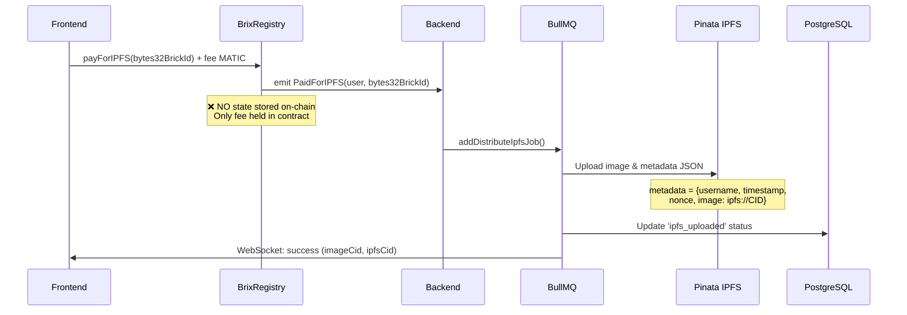
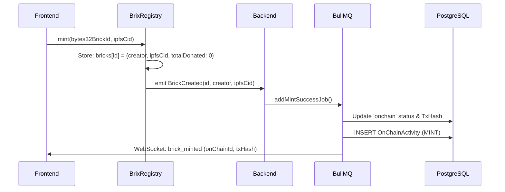
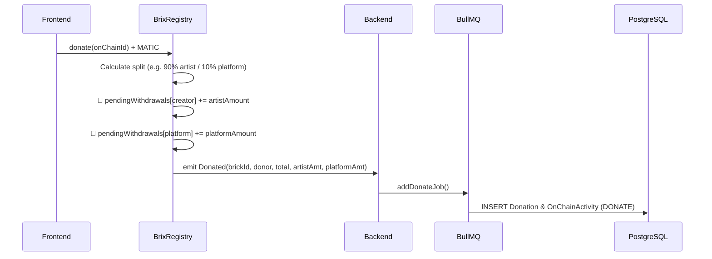
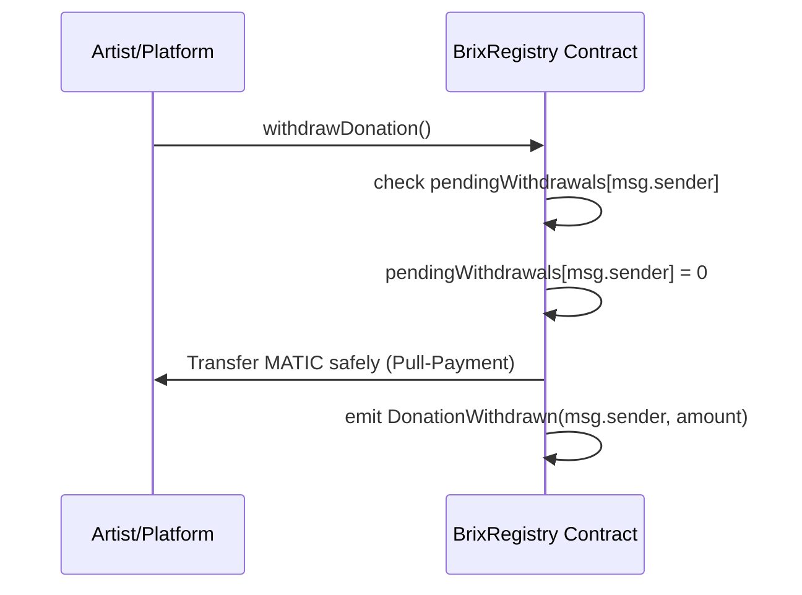

# BrixRegistry Integration Guide

This guide explains how Frontend and Backend services should interact with the `BrixRegistry.sol` smart contract on Polygon L2.

## 1. Important: Formatting `brickId` (UUID → bytes32)

To optimize Gas, the contract stores `brickId` as `bytes32`. Since your Database uses 36-character UUID strings (e.g., `9498704e-74a6-4ebe-9349-941143c19f67`), you **MUST** hash this UUID in the Backend/Frontend before passing it to the Contract.

**TypeScript (`ethers.js`) Example:**

```typescript
import { ethers } from 'ethers';

// Convert UUID to bytes32 format
const uuid = '9498704e-74a6-4ebe-9349-941143c19f67';
const bytes32BrickId = ethers.id(uuid); // Output: 0x... (32 bytes)
```

---

## 2. Core Operational Flows

### Flow 1: IPFS Fee Payment (`payForIPFS`)

Users must pay a minimum fee (e.g., `0.001 MATIC`) before the Backend uploads files/metadata to the IPFS network.



- **Frontend Action**:
    1. Fetch current fee: `const fee = await contract.ipfsFee()`
    2. Execute: `await contract.payForIPFS(bytes32BrickId, { value: fee })`
- **Backend Action**:
    1. Listen for the `PaidForIPFS(address user, bytes32 brickId)` event.
    2. Upload the corresponding image/metadata to IPFS.

### Flow 2: Minting the Brick On-chain (`mint`)

After the Backend successfully uploads to IPFS and returns an `ipfsCid`, the user finalizes the process by minting the brick on-chain.



- **Frontend Action**:
    1. Verify permission: `await contract.hasPaid(bytes32BrickId, userAddress)` (Must return `true`).
    2. Prevent double-minting: `await contract.hasMinted(bytes32BrickId, userAddress)` (Must return `false`).
    3. Execute: `await contract.mint(bytes32BrickId, ipfsCid)`
       _Note: A portion of the gas is automatically refunded when minting completes._
- **Backend Action**:
    1. Listen for the `BrickCreated(uint256 id, address creator, string ipfsCid)` event.
    2. Save `id` (uint256) into the Database. **This integer is the official On-chain ID** required for the Donate feature.

### Flow 3: Donation & Pull-Payment (`donate` / `withdrawDonation`)

Anyone can donate MATIC to an existing BRIX (using the On-chain ID). Funds are automatically split between the Artist and Platform based on configured percentages. To prevent transaction failures (reentrancies/bricked receiver contracts), funds are **NOT** sent directly to the wallets. They are securely held in the contract until the user explicitly withdraws them.



**Withdrawal (Pull-Payment):**



- **Frontend Action (Donator)**:
    1. Execute: `await contract.donate(onChainId, { value: ethers.parseEther("10") })`
       _(Note: Use `onChainId` (uint256), NOT the UUID)_.
- **Backend Action**:
    1. Listen for `Donated(uint256 brickId, address donor, uint256 amount, uint256 artistAmount, uint256 platformAmount)`.
    2. Log the transaction in the Database.

- **Frontend Action (Artist / Platform Withdrawal)**:
    1. Check pending balance: `await contract.pendingWithdrawals(userWalletAddress)`
    2. Withdraw funds: `await contract.withdrawDonation()`

---

## 3. ABI Setup for Frontend & Backend

Include this exact ABI in your `ethers.js` configuration to listen to events and trigger functions:

```typescript
export const BrixRegistryABI = [
    // --- View Helpers ---
    'function ipfsFee() external view returns (uint256)',
    'function platformFeePercent() external view returns (uint256)',
    'function hasPaid(bytes32 brickId, address user) external view returns (bool)',
    'function hasMinted(bytes32 brickId, address user) external view returns (bool)',
    'function getBrick(uint256 brickId) external view returns (address creator, string ipfsCid, uint256 totalDonated)',
    'function pendingWithdrawals(address account) external view returns (uint256)',

    // --- Write Functions ---
    'function payForIPFS(bytes32 brickId) external payable',
    'function mint(bytes32 brickId, string calldata ipfsCid) external',
    'function donate(uint256 brickId) external payable',
    'function withdrawDonation() external',

    // --- Events ---
    'event PaidForIPFS(address indexed user, bytes32 brickId)',
    'event BrickCreated(uint256 indexed id, address indexed creator, string ipfsCid)',
    'event Donated(uint256 indexed brickId, address donor, uint256 amount, uint256 artistAmount, uint256 platformAmount)',
    'event DonationWithdrawn(address account, uint256 amount)',
    'event StuckFundsWithdrawn(address owner, uint256 amount)',
    'event FeesWithdrawn(address owner, uint256 amount)',
];
```

## 4. Admin & Security Features

- **Pausable (Emergency Halt):** The Owner can trigger `pause()`. Doing so completely disables `payForIPFS`, `mint`, and `donate`. However, users **can still call `withdrawDonation`** to rescue their stuck funds at any time.
- **Gas Refunding:** `mint()` automatically releases temporary state slots to refund gas to end users.
- **Withdraw IPFS Fees:** The Owner calls `withdrawIpfsFees()` to collect revenue without touching artist donations.
- **Fund Rescue Mechanism:** The Owner can call `withdrawStuckFunds()` to extract any unstructured ETH/MATIC accidentally sent to the contract address without affecting internal user balances.
